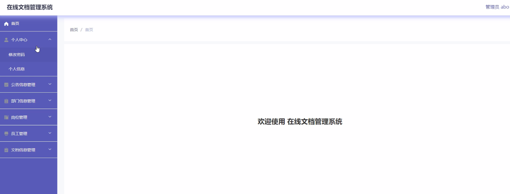
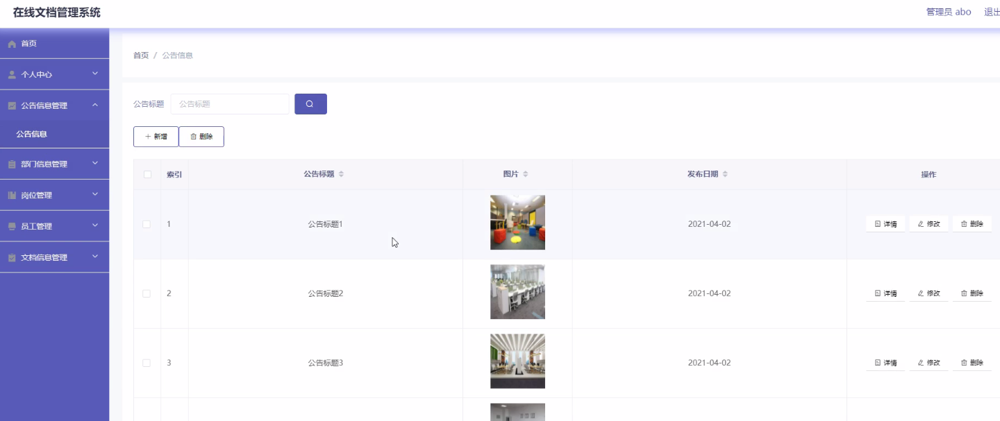
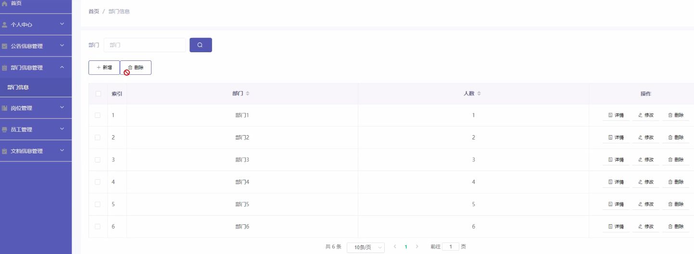
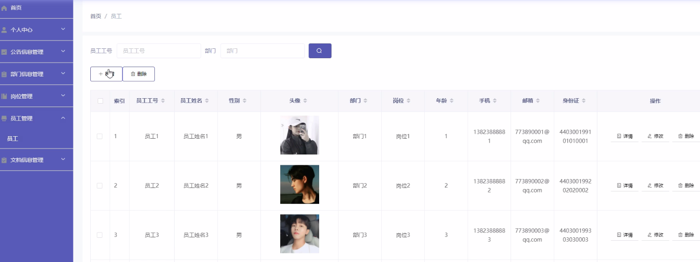
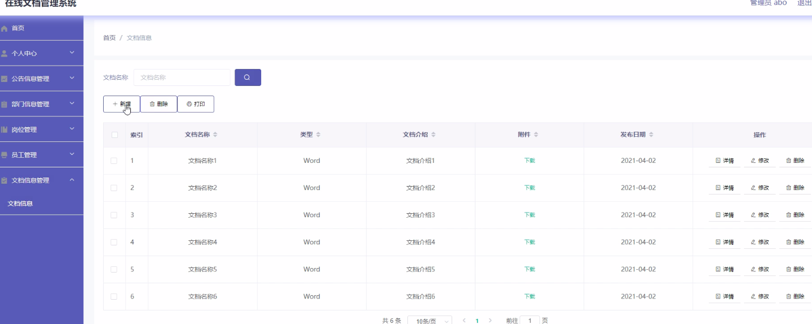
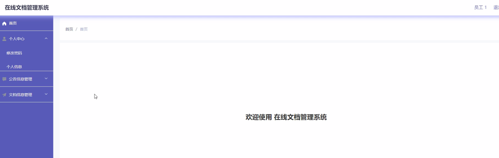
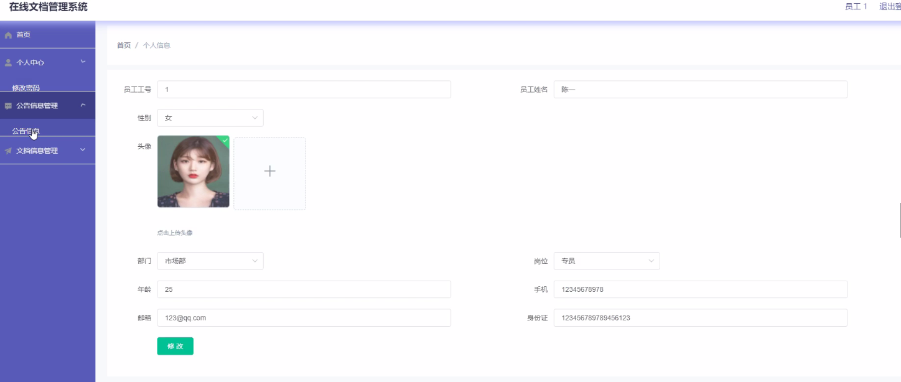
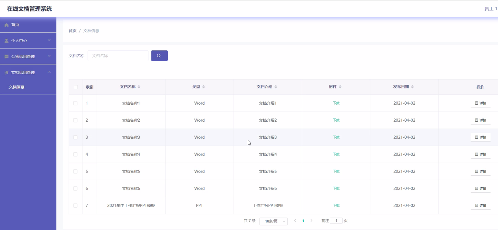

**项目简介：**  
本项目基于主流的前后端分离架构，采用 **SpringBoot + Vue 技术栈**，配套 **MySQL 数据库**，适用于毕业设计与课题实训开发。  
本人已整理了超 **4000 多套毕业设计源码+论文+开题报告+PPT...**，涵盖 **Java、SpringBoot、Vue、SSM、uni-app 小程序、PHP、Android** 等方向，支持功能修改定制与论文服务。  
**团队提供以下服务：**  
- 项目代码修改与调试  
- 数据库配置与远程协助  
- 论文定制与修改  
**获取更多的4000多套源码或SQL文件请联系：**  
- QQ：3906443360 微信：BesheHelp

# springboot026基于SpringBoot的在线文档管理系统的设计与实现

5.1管理员功能模块

管理员登录，通过填写注册时输入的用户名、密码、角色进行登录，如图5-1所示。

图5-1管理员登录界面图

管理员登录进入在线文档管理系统可以查看首页、个人中心、公告信息管理、部门信息管理、岗位管理、员工管理、文档信息管理等信息。如图5-2所示。

公告信息管理，管理员在公告信息管理页面中通过查看公告标题、图片、发布日期、内容等信息进行详情、修改、删除操作，如图5-3所示。

图5-2首页界面图

图5-3公告信息管理界面图

部门信息管理，管理员在部门信息管理页面中可以查看部门、人数、等信息，并可根据需要对部门信息进行详情、修改或删除等操作，如图5-4所示。

图5-4部门信息管理界面图

员工管理，管理员在员工管理页面中可以查看员工工号、员工姓名、性别、头像、姓名、部门、岗位、年龄、手机、邮箱、身份证等信息，并可根据需要对员工信息进行详情、修改或删除等详细操作，如图5-5所示。

图5-5员工管理界面图

文档信息管理，管理员在文档信息管理页面中可以查看文档名称、类型、文档介绍、附件、发布日期等内容，并且根据需要对文档信息进行详情、修改或删除等详细操作，如图5-6所示。

图5-6文档信息管理界面图

5.2员工功能模块

登录，员工登录，员工通过登陆页面填写员工工号、密码进行登陆，如图5-7所示。

员工登录进入在线文档管理系统可以查看首页、个人中心、公告信息管理、文档信息管理等内容。如图5-8所示。

个人中心，员工在个人信息页面中进行查看编辑员工工号、员工姓名、性别、头像、姓名、部门、岗位、年龄、手机、邮箱、身份证，进行修改操作，如图5-9所示。

图5-7登陆界面图

图5-8首页界面图

图5-9个人信息界面图

文档信息管理，员工在文档信息管理页面中可以查看文档名称、类型、文档介绍、附件、发布日期等信息内容，并且根据需要对文档信息进行下载、详情查看，如图5-10所示。

图5-10文档信息管理界面图